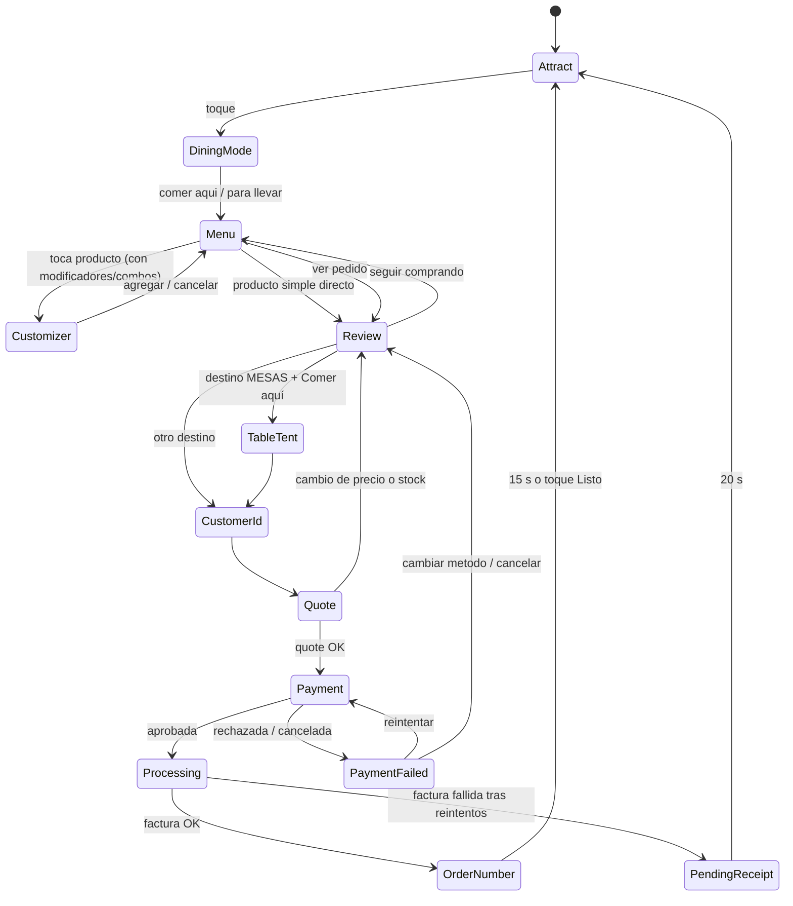
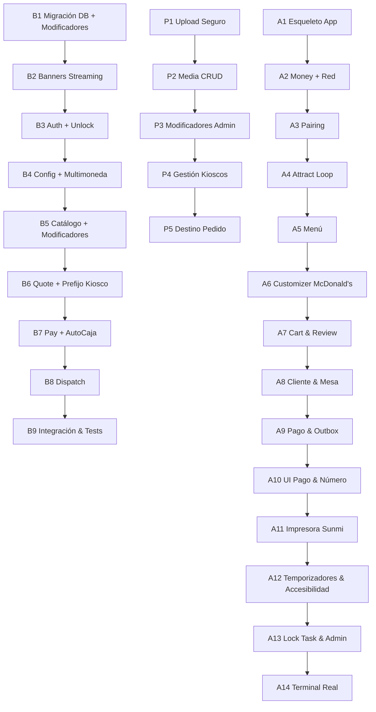

# Plan de ejecución: `amaxoniaerp-kiosk` en SUNMI K2

> **Para el agente que ejecuta el plan:** lee este documento completo antes de tocar código. Haz las tareas **en orden**. Cada tarea tiene *Archivos*, *Hacer*, *Aceptación* y *Verificar*. Una tarea no está terminada mientras su *Verificar* no pase. Si algo del código real contradice este plan, **detente y repórtalo**; no improvises.

---

## 0. Reglas que no se pueden romper

1. **Arquitectura:** cumplir ADR-001 (DI manual, composition root), ADR-002 (todo filtrado por empresa), ADR-003 (backend con `route/application/domain/data`), ADR-004 (dinero en `BigDecimal`/`Money`, nunca `Double` para cálculos) y ADR-006 (`ui → domain ← data`). En el kiosco **no existe** `DependencyContainer` ni Koin.
2. **JSON:** `Json { ignoreUnknownKeys = true; encodeDefaults = false; explicitNulls = false }`, igual en ambos lados.
3. **Nombres:** el vocabulario de negocio sale de `CONTEXT.md` (Kiosco, Pedido de kiosco, Emparejamiento, Attract loop, Clave de kiosco). El código va en inglés y los textos de UI en español e inglés.
4. **Nada a medias:** sin `TODO`, sin código comentado, sin datos falsos en producción. Los mocks viven **solo** en el flavor `dev` o en tests.
5. **Tests junto con el código:** cada caso de uso, ViewModel y endpoint lleva su test. Los fixtures de `contracts/kiosk/` se crean **en la misma tarea** que el endpoint, nunca antes.
6. **PCI:** la app **nunca** ve, guarda ni registra en logs el número de tarjeta, el PIN ni la banda o el chip. Solo recibe del procesador de pagos: aprobada o rechazada, código de autorización, referencia, últimos 4 dígitos, marca y un id de transacción.
7. **Base de datos:** todo cambio de esquema sigue `doc/runbooks/RUNBOOK_DATABASE_MIGRATION.md` y es aditivo (no se borra ni renombra ninguna columna existente).
8. **Un commit por tarea** en formato Conventional Commits (skill `caveman-commit`).

---

## 1. Investigación: SUNMI K2

> [!IMPORTANT]
> **Conclusión:** el K2 **sí puede cobrar con tarjeta, pero no de forma nativa con chip/PIN.** No es una terminal de pago certificada (PCI PTS) por sí sola. Hay dos caminos:
> 1. **(Recomendado)** Montar una **terminal de pago certificada** (SUNMI serie P, como P2/P3, o la terminal que entregue el banco) en el soporte que SUNMI ofrece para el K2. Acepta chip, PIN y contactless. El kiosco le envía el monto y recibe el resultado.
> 2. **SoftPOS NFC** usando el NFC integrado del K2. Solo sirve para contactless y solo si el banco o adquirente tiene una app SoftPOS certificada para ese equipo. En Panamá y Venezuela casi no está disponible, así que es **opcional**.
>
> **Por eso, la app no se ata a ningún banco.** Define un puerto `PaymentTerminal` con adaptadores intercambiables, igual que el POS ya hace con `PaymentGateway` y `HkaPaymentGateway` (HKA Rapid Pay por Intent).

| Característica del K2 | Dato | Qué significa para el diseño |
|---|---|---|
| Pantalla | 24" FHD 1920×1080, táctil capacitiva de 10 puntos, **vertical** | Diseñar para 1080×1920 en vertical. Densidad cercana a mdpi (1 dp ≈ 1 px) |
| Sistema | Android con SUNMI OS (Android 13) | `minSdk 29` (Android 10), compatible con Android 13 |
| CPU / RAM | Qualcomm octa-core, 6 GB / 128 GB | Video 1080p fluido con Media3 |
| Impresora | Seiko térmica de 80 mm (58 mm opcional), cortador automático, 250 mm/s | Usar `SunmiPrinterManager` del POS (`libs.sunmi.printer`). Recibo con ancho de 80 mm |
| NFC | Integrado | SoftPOS (opcional) o tarjetas de lealtad |
| Escáner 2D | Integrado (servicio `com.sunmi.scanner`) | Cupones y QR |
| Puertos | Ethernet, Wi-Fi, BT, serial RJ11 | Preferir Ethernet. Terminal de pago por LAN, BT o USB según el modelo |
| Gestión | SUNMI TMS / Device Owner | Lock Task Mode con Device Owner |

---

## 2. Decisiones consolidadas (ADR-009)

| # | Decisión |
|---|---|
| D1 | **El pago se hace en el kiosco** con tarjeta mediante el puerto `PaymentTerminal`. Adaptadores: `DevMockPaymentTerminal` (solo dev), `IntentPaymentTerminal` (app de pago en el mismo equipo, siguiendo el patrón de `TheFactoryRapidPayClient`) y `EcrLanPaymentTerminal` (terminal externa por LAN). El adaptador real se implementa con el adquirente (§9). |
| D2 | **Factura fiscal obligatoria.** Prioridad inicial: **Panamá** (FE por PAC con CUFE y QR). En Venezuela solo modalidad **digital** (`ve-digital`), ya que el K2 no cuenta con impresora fiscal física HKA20. Reutiliza el `ProcessSaleUseCase` existente. |
| D3 | **Ciclo de Caja 100% automático:** Cada kiosco es una Caja del ERP. Al procesar pedidos, si la caja tiene una secuencia de un día anterior abierta, el backend la cierra automáticamente con `CajaAutoClose` (diferencias en 0) y abre la nueva secuencia para la fecha actual de forma transparente sin intervención humana. |
| D4 | **Múltiples kioscos por sucursal:** Cada pedido diario lleva el prefijo identificador del kiosco (ej. `K1-001`, `K2-001`) para que en pantallas de llamado y cocina nunca colisionen pedidos de distintos kioscos. |
| D5 | **Cliente por defecto y crédito fiscal:** Se preselecciona el cliente por defecto de `parametros_generales` ("Consumidor Final"), pero se presenta una pantalla para ingresar RUC/Cédula/DV para quien requiera factura con datos fiscales. |
| D6 | **Multimoneda:** Precios calculados en moneda base (USD) y convertidos a moneda secundaria con la tasa de cambio vigente para visualización (referencia Bs en VE). Toda la matemática interna usa `Money`/BigDecimal ([ADR-004](file:///D:/PROGRAMMING/Kotlin/Amaxonia/doc/adr/ADR-004-money-rounding-boundaries.md)). |
| D7 | **Filtro de catálogo:** Se muestran solo los departamentos con `visible_pos = 1` y productos a Precio Nivel A. Promociones quedan excluidas del MVP. |
| D8 | **Combos y modificadores en MVP (Flujo McDonald's):** Soporte de personalización de ítems (grupos de modificadores: tamaño, término, ingredientes/extras, bebidas, salsas) con reglas de selección mínima y máxima, precio extra y desglose en comanda de cocina y ticket fiscal. |
| D9 | **Cotización previa al pago:** El servidor calcula totales, impuestos y modificadores en un `quoteId` (TTL 10 min). Se cobra **exactamente** ese monto. |
| D10 | **Sin pedidos offline.** Sin red, el kiosco muestra "Fuera de servicio" en el banner inferior y bloquea ordenar. Catálogo y banners se conservan en caché local. |
| D11 | **Pagado sin factura:** Si el cobro se aprueba pero la factura fiscal falla tras reintentos automáticos, el pedido queda `PAGADO_SIN_FACTURA`, se imprime un comprobante con el número de pedido y la referencia para conciliación. **Nunca** se recobra. |
| D12 | **Destino del pedido configurable por empresa:** `RETIRO_MOSTRADOR` (ticket con número), `IMPRESORA_COCINA` (comanda ESC/POS a la IP de cocina) o `MESAS` (inyección directa al módulo de mesas con portamesa). |

---

## 3. El flujo tipo McDonald's (especificación de UX)

**Lienzo:** vertical, 1080×1920 dp. **Zona de alcance:** acciones principales en el **60 % inferior**. **Toques:** mínimo 88 dp, 120 dp para el CTA principal. **Tipografía:** 28 sp cuerpo, 48 sp títulos.



### Detalle de Pantallas

| Pantalla | Contenido | Reglas |
|---|---|---|
| **Attract** | Banners/videos de `/config` en pantalla completa. CTA abajo: "Toca para ordenar". Selector ES/EN | Videos en loop con Media3. Sin red: banner rojo "Fuera de servicio" y CTA bloqueado |
| **DiningMode** | "Comer aquí" y "Para llevar" (tarjetas de 400 dp) | Se salta si la empresa solo tiene 1 modalidad activa |
| **Menu** | Columna izquierda (260 dp) con categorías (`visible_pos = 1`). Cuadrícula de 2 columnas con productos (foto, nombre, precio base + ref secundaria). Barra inferior fija: cantidad de ítems, total, "Ver pedido" y "Cancelar" | Ítems agotados en gris y con badge "Agotado". |
| **Customizer (Modal McDonald's)** | Asistente paso a paso para el producto:<br>1. **Tamaño / Tipo** (radio button, min:1, max:1)<br>2. **Combo / Acompañante** (papas, aros, ensalada)<br>3. **Bebida** (soda, agua, jugo)<br>4. **Ingredientes / Extras** ("Sin cebolla", "+ Extra queso $0.50", "+ Tocineta $1.00", selector -/+) | Muestra el precio actualizado en tiempo real en el botón "Agregar al pedido · $X.XX". Valida que se cumplan las selecciones obligatorias (min_seleccion) antes de permitir agregar. |
| **Review** | Lista de ítems con sus modificadores desglosados en sangría, botones −/+, botón de eliminar, desglose de subtotal, ITBMS/IVA y total. | Modificar cantidad recalcula los totales de los modificadores |
| **TableTent** | "Toma un número de mesa / portamesa y escríbelo aquí" (teclado numérico gigante) | Solo si `destino = MESAS` y la modalidad es "Comer aquí" |
| **CustomerId** | "¿Deseas ingresar RUC o Cédula para tu factura?": "Continuar como Consumidor Final" (botón principal destacado) o formulario con teclado en pantalla para ingresar RUC/Cédula y DV. | Preselecciona el cliente por defecto de `parametros_generales`. |
| **Quote** | Spinner interactivo (1-2 s) mientras valida con el servidor | Si hay cambio de precio o stock, regresa a Review con alerta clara |
| **Payment** | Animación visual apuntando a la terminal de pago física ("Inserta, acerca o desliza tu tarjeta"), monto en grande, cuenta regresiva de 90 s y botón "Cancelar" | Timeout → cancelar en la terminal → PaymentFailed |
| **Processing** | "Procesando pago y generando factura fiscal..." | Sin botón de cancelar, navegación bloqueada |
| **OrderNumber** | **Número de pedido grande (ej. K1-042)**, "Por favor retira tu comprobante", instrucciones de entrega ("Espera tu llamado en pantalla" o "Llevaremos tu pedido a la mesa"). | Imprime comprobante fiscal con CUFE y QR en 80 mm con cortador. Vuelve a Attract tras 15 s o al presionar "Finalizar". |
| **PendingReceipt** | "Tu pago fue aprobado. Por favor acércate al mostrador con este comprobante para retirar tu pedido." | Imprime comprobante con datos de referencia bancaria para soporte manual. |

---

## 4. Backend: `features/kiosk`

### 4.1 Esquema nuevo (migración aditiva por empresa)
```sql
-- Gestión de Dispositivos Kiosco
CREATE TABLE kiosco_dispositivo (
  id CHAR(36) PRIMARY KEY,
  nombre VARCHAR(80) NOT NULL,
  prefijo_pedido VARCHAR(5) NOT NULL DEFAULT 'K1',
  id_caja VARCHAR(36) NOT NULL,
  id_sucursal INT NOT NULL,
  id_almacen INT NOT NULL,
  cod_vendedor INT NOT NULL,
  id_cliente_generico VARCHAR(36) NOT NULL,
  token_hash CHAR(64) NULL,
  codigo_emparejamiento_hash CHAR(64) NULL,
  codigo_expira_en DATETIME NULL,
  activo TINYINT(1) NOT NULL DEFAULT 1,
  ultimo_contacto DATETIME NULL,
  creado_en DATETIME NOT NULL
);

-- Media para Attract Loop
CREATE TABLE kiosco_media (
  id INT AUTO_INCREMENT PRIMARY KEY,
  tipo ENUM('IMAGE','VIDEO') NOT NULL,
  archivo VARCHAR(255) NOT NULL,
  orden INT NOT NULL DEFAULT 0,
  duracion_seg INT NOT NULL DEFAULT 6,
  activo TINYINT(1) NOT NULL DEFAULT 1,
  updated_at DATETIME NOT NULL
);

-- Grupos de Modificadores (McDonald's Customization)
CREATE TABLE item_modificador_grupo (
  id INT AUTO_INCREMENT PRIMARY KEY,
  nombre VARCHAR(80) NOT NULL,
  min_seleccion INT NOT NULL DEFAULT 0,
  max_seleccion INT NOT NULL DEFAULT 1,
  es_obligatorio TINYINT(1) NOT NULL DEFAULT 0,
  es_combo TINYINT(1) NOT NULL DEFAULT 0,
  orden INT NOT NULL DEFAULT 0,
  activo TINYINT(1) NOT NULL DEFAULT 1
);

CREATE TABLE item_modificador (
  id INT AUTO_INCREMENT PRIMARY KEY,
  id_grupo INT NOT NULL,
  id_item_asociado INT NULL, -- descuenta inventario si aplica
  nombre VARCHAR(80) NOT NULL,
  precio_adicional DECIMAL(18,4) NOT NULL DEFAULT 0.0000,
  orden INT NOT NULL DEFAULT 0,
  activo TINYINT(1) NOT NULL DEFAULT 1,
  FOREIGN KEY (id_grupo) REFERENCES item_modificador_grupo(id)
);

CREATE TABLE item_modificador_relacion (
  id_item INT NOT NULL,
  id_grupo INT NOT NULL,
  orden INT NOT NULL DEFAULT 0,
  PRIMARY KEY (id_item, id_grupo)
);

-- Pedidos del Kiosco
CREATE TABLE kiosco_pedido (
  id CHAR(36) PRIMARY KEY,                 -- = Idempotency-Key
  id_dispositivo CHAR(36) NOT NULL,
  numero_pedido_diario INT NOT NULL,
  codigo_pedido VARCHAR(20) NOT NULL,      -- Ej: K1-042
  fecha DATE NOT NULL,
  estado ENUM('COTIZADO','PAGADO','FACTURADO','PAGADO_SIN_FACTURA','ANULADO','RECHAZADO') NOT NULL,
  modalidad ENUM('COMER_AQUI','PARA_LLEVAR') NOT NULL,
  portamesa VARCHAR(10) NULL,
  id_cliente VARCHAR(36) NOT NULL,
  total DECIMAL(18,4) NOT NULL,
  quote_expira_en DATETIME NOT NULL,
  pago_referencia VARCHAR(64) NULL,
  pago_autorizacion VARCHAR(32) NULL,
  pago_ultimos4 CHAR(4) NULL,
  pago_marca VARCHAR(20) NULL,
  id_factura VARCHAR(36) NULL,
  motivo_rechazo VARCHAR(255) NULL,
  creado_en DATETIME NOT NULL,
  actualizado_en DATETIME NOT NULL,
  UNIQUE KEY uq_kiosco_pedido_dia (id_dispositivo, fecha, numero_pedido_diario)
);

CREATE TABLE kiosco_pedido_item (
  id_pedido CHAR(36) NOT NULL,
  linea INT NOT NULL,
  id_item INT NOT NULL,
  cantidad DECIMAL(18,4) NOT NULL,
  precio_unitario DECIMAL(18,4) NOT NULL,
  nota VARCHAR(80) NULL,
  PRIMARY KEY (id_pedido, linea)
);

CREATE TABLE kiosco_pedido_item_modificador (
  id_pedido CHAR(36) NOT NULL,
  linea INT NOT NULL,
  id_modificador INT NOT NULL,
  nombre VARCHAR(80) NOT NULL,
  precio_adicional DECIMAL(18,4) NOT NULL,
  PRIMARY KEY (id_pedido, linea, id_modificador)
);

-- Columnas añadidas a parametros_generales:
--   kiosco_destino_pedido ENUM('RETIRO_MOSTRADOR','IMPRESORA_COCINA','MESAS') DEFAULT 'RETIRO_MOSTRADOR'
--   kiosco_impresora_cocina_ip VARCHAR(45) NULL, kiosco_modalidades VARCHAR(30) DEFAULT 'COMER_AQUI,PARA_LLEVAR'
--   kiosco_color_marca CHAR(7) NULL, kiosco_config_version INT NOT NULL DEFAULT 1
```

### 4.2 Endpoints (`/api/v1/kiosk`)

| Método y ruta | Auth | Request → Response |
|---|---|---|
| `POST /pairing` | pública (rate limit) | `{countryCode, companyDb, pairingCode}` → `{deviceId, deviceToken, deviceName, prefix}` |
| `GET /config` | Bearer `KIOSK` | → `{version, brandColor, logoUrl, media:[{type,url,durationSec}], diningModes, dispatch, defaultCustomerId, currency:{base, secondary, rate}, country}` + `ETag` |
| `GET /catalog` | Bearer `KIOSK` | → `{categories:[{id,name,iconUrl,order}], items:[{id,categoryId,name,description,price,taxRate,imageUrl,soldOut,modifierGroups:[{id,name,min,max,isMandatory,isCombo,options:[{id,name,extraPrice,soldOut}]}]}]}` + `ETag` |
| `POST /orders/quote` | Bearer `KIOSK` + `Idempotency-Key` | `{diningMode, tableTent?, customerId?, lines:[{itemId,qty,note?,modifiers:[idModificador]}]}` → `{orderId, subtotal, tax, total, expiresAt, formattedOrderNumber, lines:[…con precios calculados por backend]}` |
| `POST /orders/{id}/pay` | Bearer `KIOSK` | `{transactionId, authCode, reference, last4, brand, amount}` → `{orderNumber, invoice:{codFactura,cufe?,qr?,fechaRecepcionDGI?}, dispatch, receipt:{…datos formateados para 80mm}}` |
| `POST /unlock` | Bearer `KIOSK` | `{password}` → 204 |
| `GET /api/data/{cc}/{db}/banners/{filename}` | pública | Stream con `PartialContent` (soporte de Range para video) |

### 4.3 Automatización de Caja en el Backend
En `PlaceKioskOrderService` / `QuoteKioskOrderService`:
1. Consulta la secuencia activa para la `id_caja` del dispositivo.
2. Si no hay secuencia abierta hoy, pero hay una secuencia de un día anterior: llama a `buildAutoCloseRequest()` y `cajaCierre()` para cerrarla con diferencias 0.
3. Si no hay secuencia abierta para hoy: llama a `cajaApertura()` con monto inicial 0.
4. Vincula la factura a la secuencia abierta de hoy.

### 4.4 Tareas de Backend

| ID | Tarea | Aceptación |
|---|---|---|
| B1 | Migración SQL aditiva + `KioskTables.kt` + `ModifierTables.kt` (Exposed) | Corre limpia en esquemas PA y VE |
| B2 | Endpoint de banners en `AssetsRoutes.kt` con `PartialContent` + `Cache-Control: immutable` | Prueba: Range 0-99 devuelve 206 Partial Content |
| B3 | `KioskAuth` + `POST /pairing` + `POST /unlock` (bcrypt) | Token de kiosco aislado; rate limit en unlock |
| B4 | `GET /config` con ETag y soporte multimoneda (moneda base, secundaria y tasa) | 304 si el ETag coincide |
| B5 | `GET /catalog` filtrando solo departamentos con `visible_pos = 1`, precios nivel A, desglose de grupos de modificadores y opciones | Fixture `contracts/kiosk/catalog-response.json` |
| B6 | `POST /orders/quote` con cálculo de modificadores en `Money`, numeración diaria con prefijo de kiosco (ej. `K1-001`) y validación de mínimos/máximos de selección | Cotización idempotente y cálculo exacto |
| B7 | `POST /orders/{id}/pay` con apertura/cierre automático de caja (`CajaAutoClose`) y llamada a `ProcessSaleUseCase` | Venta genera factura fiscal (PA: CUFE/QR, VE: digital). Si falla fiscal → 202 `PAID_PENDING_INVOICE` |
| B8 | `OrderDispatchPolicy` (Retiro en mostrador, Impresora cocina LAN ESC/POS y Mesas) | Tests unitarios para las 3 estrategias |
| B9 | Inyección en `AppDependenciesFactory.kt`, registro en `Routing.kt` y tests de integración | `./gradlew test` con cobertura ≥ 80% en paquete `kiosk` |

---

## 5. Admin PHP (`parametros_generales` y nuevo módulo `kioscos`)

| ID | Tarea | Aceptación |
|---|---|---|
| P1 | Validación de archivos con `finfo_file` (jpg, png, webp, mp4), límite 10MB imagen / 80MB video y corrección del bug L196 | No permite subir ejecutables |
| P2 | Pestaña Kiosko: CRUD de `kiosco_media` con ordenación y preview de videos | Actualiza `kiosco_config_version` |
| P3 | Módulo de Modificadores en Admin: crear grupos (ej. "Salsas", "Bebida", "Término"), definir min/max y precio extra de opciones, y asociarlos a productos | Los productos reflejan sus grupos |
| P4 | Módulo `app/module/kioscos`: registro de kioscos (nombre, prefijo ej. `K1`, caja asociada, sucursal, almacén) y generación de código de emparejamiento de 8 dígitos | Generación y revocación funcional |
| P5 | Configuración de destino del pedido e IP de impresora de cocina en `parametros_generales` | Campos persistidos |

---

## 6. App Android `amaxoniaerp-kiosk`

### 6.1 Módulos y Arquitectura
- `applicationId com.amaxonia.kiosk`, `minSdk 29`, `targetSdk 36`, Compose BOM, Ktor Client, Room, Media3 ExoPlayer, Coil, Sunmi Printer Library.
- DI manual con `AppGraph` y `OrderGraph`.

### 6.2 Flujo de Modificadores (McDonald's Style) en la App
- `ProductCustomizerViewModel`: controla la selección de modificadores de un ítem.
- `CustomizerScreen`: Modal a pantalla completa con navegación por pasos o scroll estructurado por grupos de modificadores:
  - Grupos obligatorios marcados con "Obligatorio (Elige 1)".
  - Botones de selección de tamaño y combos con imagen en miniatura.
  - Sección de extras con botones `+` y `-` y precio diferencial claramente indicado (`+$0.50`).
  - Barra de acción inferior reactiva: "Agregar · $6.50" (o en multimoneda: "$6.50 / Ref. Bs 234.00").

### 6.3 Tareas de Android

| ID | Tarea | Aceptación |
|---|---|---|
| A1 | Esqueleto del proyecto con catálogo de versiones, orientación vertical 1080x1920, modo inmersivo y flavors `dev`/`prod` | Compilación limpia y detekt/ktlint en verde |
| A2 | `core/money` (Money BigDecimal), `core/network` (Ktor + Token seguro en Keystore + ETag) | Tests de dinero y red pasando |
| A3 | Pantalla de Emparejamiento (`PairingScreen`) + guardado seguro de credenciales | Emparejamiento exitoso contra endpoint `/pairing` |
| A4 | `AttractScreen` con Media3 ExoPlayer (loop continuo sin pausas, caché local de 1GB) y Coil | Reproducción fluida y offline-ready |
| A5 | `MenuScreen` con cuadrícula de productos (categorías `visible_pos = 1`, precio nivel A + multimoneda) | Navegación fluida y scroll a 60 fps |
| A6 | `CustomizerScreen` (Flujo McDonald's de modificadores y combos) con validación de mínimos y cálculo reactivo | No permite avanzar si falta un grupo obligatorio |
| A7 | Carrito (`Cart`), `ReviewScreen` (desglose jerárquico de producto y modificadores) y `DiningModeScreen` ("Comer aquí" / "Para llevar") | Eliminación y ajuste de cantidades exacto |
| A8 | `CustomerIdScreen` (Consumidor Final por defecto o entrada de RUC/Cédula) y `TableTentScreen` (Portamesa) | Selección ágil sin fricción |
| A9 | `PaymentTerminal` (puerto), `DevMockPaymentTerminal`, `CheckoutOrderUseCase` con outbox Room `PendingPayment` y reintentos idempotentes | Tests de flujo de cobro completos |
| A10 | Pantallas `PaymentScreen` (animación apuntando al lector, timeout 90s), `ProcessingScreen` y `OrderNumberScreen` (número grande ej. `K1-042`) | Interfaz clara y legible |
| A11 | Impresión en Seiko 80mm con `SunmiPrinterManager` (recibo fiscal con CUFE/QR, ticket de cocina o comprobante de pago pendiente) | Impresión y corte automático de papel |
| A12 | `IdleTimer` (60s inactividad → diálogo 20s → reset a Attract) + Modo accesible + Textos bilingües (ES/EN) | Reset automático del carrito al abandonar |
| A13 | Modo Kiosco: `LockTaskController` (Device Owner), `BootReceiver` y acceso a menú Admin mediante 5 toques + Clave | Bloqueo total de botones de sistema |
| A14 | Adaptador real de `PaymentTerminal` (Intent / ECR LAN) según el procesador de pagos provisto (§9) | Integración con terminal física |

---

## 7. Orden de Ejecución



---

## 8. Verificación Final
1. **Backend:** `.\gradlew.bat test jacocoTestReport` en `amaxoniaerp-backend` (cobertura ≥ 80%).
2. **App:** `.\gradlew.bat detekt ktlintCheck testDevDebugUnitTest assembleProdRelease` en `amaxoniaerp-kiosk`.
3. **End-to-End en Emulador Vertical 1080x1920:**
   - Emparejar kiosco `K1`.
   - Attract loop reproduce video en pantalla completa.
   - Toque → "Comer aquí" → Seleccionar Hamburguesa → Customizer: Elegir Papas Grandes (+ $0.80), Sin Cebolla, Extra Queso (+ $0.50) → "Agregar".
   - Review muestra ítem y adicionales → Continuar como Consumidor Final → Pago simulado → Impresión simulada y pantalla con número `K1-001` y factura generada con su secuencia de caja abierta automáticamente.

---

## 9. Acciones Humanas Requeridas
1. **Hardware:** Verificar unidad SUNMI K2 con Android 13 y terminal SUNMI P2/P3 o adquirente bancario montada en el soporte.
2. **Adquirente Bancario:** Gestionar con el banco adquirente (Panamá: Banco General / BAC / Banistmo / Credicorp; Venezuela: HKA Rapid Pay) el SDK o especificación de integración y terminal de prueba para completar A14.
3. **Aprovisionamiento:** Ejecutar `adb shell dpm set-device-owner com.amaxonia.kiosk/.KioskAdminReceiver` en cada unidad K2 reseteada de fábrica.
