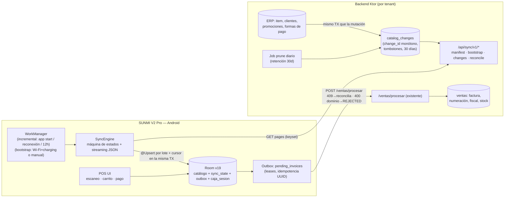
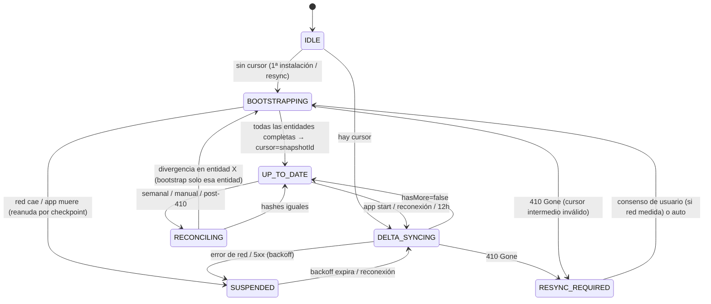

# PLAN_OFFLINE_SYNC_DESIGN — Sincronización offline catálogo ↔ POS (SUNMI V2 Pro)

> Estado: **diseño aprobado para implementación pendiente**. Complementa
> [ADR-007](adr/ADR-007-offline-catalog-sync-change-feed.md) y el glosario en [CONTEXT.md](../CONTEXT.md).
> Investigación con fuentes primarias: `.scratch/sync-architecture-research/REPORT.md`.

---

## 0. Decisiones adoptadas por defecto (pendientes de confirmación explícita)

Estas se propusieron en la ronda 2 del grill y **no** recibieron respuesta explícita; se
adoptan como diseño por defecto. Marcar ✔ cuando se confirmen.

| # | Decisión | Valor adoptado |
|---|----------|----------------|
| Q11 | Política de stock offline | Stock fuera del feed; server único juez; taxonomía de errores nueva (§13) |
| Q12 | Alcance offline de caja | Fase 1: sesión persistente + status jamás bloquea. Fase 2: apertura/cierre offline vía outbox. Regla: 1 caja = 1 terminal a la vez |
| Q13 | Legitimidad fiscal offline | Ticket no fiscal offline + numeración/autorización al reconectar es el flujo aceptado; solo HKA20 imprime fiscal sin red |
| Q14 | ¿POS edita productos? | **RESUELTA Y CERRADA vía D1/D2** — ver filas siguientes |
| D1 ✔ | Edición de productos en POS (confirmada 2026-09-04) | **Restringida**: `ProductFormScreen` fuera del grafo de navegación; FAB y tap-a-editar eliminados de `ProductListScreen` (solo lectura: búsqueda + stock). El POS solo factura y hace procesos adyacentes; el catálogo se administra exclusivamente desde el ERP/web |
| D2 ✔ | Política de conflicto (confirmada 2026-09-04) | Con D1, el ERP es la única fuente de verdad del catálogo: **sin resolución de conflictos bidireccional**. Feed unidireccional server→POS en todo su rigor |
| D3 ✔ | Verificación de triggers (confirmada 2026-09-04) | Staging **MySQL 5.7 ESTRICTO** por país (producción NO es MariaDB ni MySQL 8) con checklist §16.14. Sin testcontainers por ahora. DDL `005` auditado y anotado para 5.7 |
| D4 ✔ | `item.estatus` (confirmada 2026-09-04) | Agregado al DTO slim y a Room v19. El POS filtra localmente para vender (solo activos) **sin borrado físico** — protege la integridad de ventas previas. Nota: la columna es `varchar(1)` default `'A'`; el valor exacto de "activo" se confirma en staging (§16) |
| Q15 | Retención del feed | 30 días; `410 Gone` → resync completo automático |
| Q16 | Cadencia de reconciliación | Semanal (charging + Wi-Fi) + botón manual + automática tras 410 |
| Q17 | Criterios de éxito | Los de §15 |
| Q18 | Disciplina de contrato | Additive-only + `schemaVersion` en manifest + versión mínima de app |

---

## 1. Diagnóstico (por qué el sync actual es lento)

**21.811 productos ≈ 11–22 MB. SQLite no es el problema.** Las causas medibles, con
evidencia de código:

1. Re-descarga completa siempre — sin `since`/cursor (`CatalogSyncer.kt:110-125`, `SyncScheduler.kt:24-43`).
2. 73 requests seriales de 300 ítems; el backend permite 1.000/página (`ItemsRoutes.kt:31-32`).
3. Payload gordo (~30 campos + 5 precios × 8 derivados) vs entidad local de 16 columnas (`ProductDtos.kt:5-51` vs `Mappers.kt:91-109`).
4. N+1 doble: app → 1 HTTP por cliente para sucursales (`CatalogSyncer.kt:95-105`); backend → 1 SQL por fila para marca (`ItemsRowMappers.kt:169-175`).
5. No reanudable: reintento desde offset 0; flag solo al final (`CatalogSyncer.kt:65`).
6. `REPLACE` por fila, sin WAL explícito, **cero índices secundarios** (`Daos.kt:54-56`, `AppDatabase.kt:771-798`, schema `18.json`).
7. Borrados nunca se propagan.
8. Bugs de reconciliación de ventas: 400 de dominio → reintento infinito sin tope (`PendingInvoiceEntity.kt:50-51`); 409 tratado como transitorio en el worker (`SalesApiImpl.kt:58-73`); el loop salta filas fallidas → desorden de aplicación (`SynchronizePendingInvoicesUseCase.kt:101-136`).

## 2. Arquitectura (diagrama)



Principios:

- **Feed apéndice + cursor local**: el servidor nunca guarda estado por dispositivo; el
  dispositivo nunca adivina qué cambió.
- **Todo lote aplicado es transaccional con su checkpoint** (datos + cursor en la misma TX Room).
- **Catálogo server-authoritative, unidireccional.** Las ventas son el único flujo POS→server.
- **Nunca se descarga el catálogo completo dos veces**: el incremental es O(cambios).

## 3. Contratos de API (`/api/sync/v1`)

Todos bajo autenticación existente + contexto de empresa (tenant) actual. Los endpoints
actuales (`/items`, `/clientes`, etc.) **no cambian**: compatibilidad con apps viejas.

### 3.1 `GET /api/sync/v1/manifest`

```json
{
  "hashScheme": "xxh64-content-v1",
  "schemaVersion": 1,
  "minAppVersion": "2.1.0",
  "serverTime": "2026-09-03T12:00:00Z",
  "retentionDays": 30,
  "latestChangeId": 482913,
  "entities": [
    { "type": "PRODUCT",         "count": 21811, "hash": 193482734 },
    { "type": "CLIENT",          "count": 3102,  "hash": 88123001  },
    { "type": "CLIENT_BRANCH",   "count": 5240,  "hash": 2201550   },
    { "type": "CLIENT_TYPE",     "count": 9,     "hash": 4120      },
    { "type": "PROMOTION",       "count": 47,    "hash": 90812     },
    { "type": "PROMOTION_DETAIL","count": 610,   "hash": 770123    },
    { "type": "PAYMENT_METHOD",  "count": 6,     "hash": 3321      },
    { "type": "CAJA_PAYMENT_METHOD", "count": 21, "hash": 5510     }
  ]
}
```

#### 3.1.1 Hash de contenido (detección de divergencia REAL, no solo de pertenencia)

Un hash solo sobre `entity_id` detecta filas de más/menos pero **nunca** una fila
presente en ambos lados con contenido distinto (precio cambiado, código de barras
cambiado sin UPSERT propagado) — justo el fallo que la reconciliación debe
cazar. Por eso el agregado es **conmutativo e incluye contenido**:

```
row_hash  = XXH64( encode(entity_id, campos_canonicos_del_dto_slim) )
hash(ent) = SUM mod 2^64 de los row_hash de todas las filas vigentes de la entidad
```

- `encode` es una codificación canónica **no ambigua** (tags de tipo + longitud
  big-endian; `null` ≠ `""` ≠ campo ausente; `Double` como `doubleToLongBits`,
  que canonicaliza NaN). Especificación completa en el módulo compartido
  `CatalogContentHash` (backend: `features/sync/domain/CatalogContentHash.kt`;
  cliente: `data/sync/CatalogContentHash.kt` — **archivos duplicados verbatim
  salvo package**, sin dependencias externas).
- Campos canónicos de PRODUCT = exactamente lo que el POS almacena en Room
  (17 columnas — las 16 originales + `estatus` según D4 — + `prices` de 5
  niveles × 8 campos derivados). Cualquier campo del DTO que el POS no guarda
  no participa del hash.
- La suma modular forma grupo: conmutativa, independiente del orden de
  iteración, y admite mantenimiento incremental futuro (restar aporte viejo,
  sumar el nuevo) sin cambiar el esquema. Un `hashScheme` en el manifest
  permite evolucionar a `v2` sin ambigüedad.
- `count` + `hash` juntos detectan: altas, bajas **y** cambios de contenido.

**Dónde se calcula (decisión)**: **on-demand con memoización** en `/manifest`,
cacheado por proceso con clave `(empresa, entidad) → (MAX(change_id), manifest)`.
Racional: (1) exige UNA única implementación canónica (Kotlin) compartida
verbatim con el cliente — materializar el hash en SQL/trigger duplicaría la
codificación canónica en un segundo lenguaje y ese drift es exactamente lo que
el hash existe para detectar; (2) el costo se paga una vez por cambio de estado
por proceso (21k filas ≈ decenas de ms), no por request; (3) los triggers quedan
identity-only (§4.1). El cliente lo calcula igual, bajo demanda, iterando en
stream las filas Room de la entidad (solo en reconciliación).

**Implementado y verificado (2026-09-04)**: módulo en ambos lados + tests.
Verificación: vectores oficiales de XXH64 validados contra la librería C
`xxhash` (incluye inputs multi-stripe); test de divergencia de contenido
(mismo ID, campo distinto ⇒ cambia row_hash y agregado); conmutatividad;
fixture cruzado `FIXTURE_DIGEST_V1 = 6146994974349010023` que DEBE dar igual
en backend y app (tests `CatalogContentHashTest` de ambos repos, 7/7 y 8/8
verdes).

- **Fixture cruzado re-fijado tras D4**: al incorporar `estatus` al esquema
  canónico, el digest del fixture pasó de `6146994974349010023` a
  **`3132355712640916076`** en ambos repos (tests 7/7 backend y 8/8 POS).
- Usado por: reconciliación semanal (§7.3) y para decidir si hace falta bootstrap.
- `ETag` sobre la respuesta: si no cambió, 304 (probe barato al abrir la app).

### 3.2 `GET /api/sync/v1/bootstrap/{entityType}?afterId={key}&limit=1000&snapshotId={changeId}`

- Keyset pagination por PK de la tabla fuente (`WHERE id > :afterId ORDER BY id LIMIT :limit`),
  **nunca OFFSET**.
- `snapshotId` = `latestChangeId` del manifest: el servidor sirve filas cuyo estado cabe
  dentro del snapshot (consistencia sin bloquear escrituras).
- Respuesta:

```json
{
  "entityType": "PRODUCT",
  "snapshotId": 482913,
  "items": [ { "id": "ITM-000123", "code": "A123", "description": "…",
               "barcode1": "7450000123456", "…": "…", "prices": [ … valores crudos nivel A–E … ] } ],
  "nextAfterId": "ITM-001322",
  "hasMore": false
}
```

- Streaming: el servidor serializa el array incrementalmente (chunked); el cliente parsea
  con `JsonReader` sobre `InputStream` — el JSON completo nunca vive en memoria.
- Orden de bootstrap: `CLIENT_TYPE → CLIENT → CLIENT_BRANCH → PRODUCT → PROMOTION → PROMOTION_DETAIL → PAYMENT_METHOD → CAJA_PAYMENT_METHOD`.

### 3.3 `GET /api/sync/v1/changes?cursor={changeId}&limit=1000`

- Keyset sobre `change_id` (`WHERE change_id > :cursor ORDER BY change_id LIMIT :limit`)
  dentro de la DB de empresa de la request.
- Incluye upserts **y** tombstones en un solo stream ordenado. El `payload` se
  **hidrata al leer**: cada cambio UPSERT se resuelve con la fila vigente de la
  tabla fuente (join por `entity_id`); si la fila ya no existe, se sirve como
  DELETE. Consecuencias: (a) el feed no duplica serialización (§4.1), (b) los
  cambios intermedios de una fila mutada dos veces se coalescen solos, (c) un
  INSERT+DELETE entre dos syncs del dispositivo degenera en un DELETE inofensivo.

```json
{
  "changes": [
    { "changeId": 482914, "entityType": "PRODUCT", "entityId": "ITM-000123",
      "op": "UPSERT", "schemaVersion": 1, "payload": { "…dto slim…" } },
    { "changeId": 482915, "entityType": "PRODUCT", "entityId": "ITM-000999",
      "op": "DELETE", "schemaVersion": 1 }
  ],
  "nextCursor": 483100,
  "hasMore": false,
  "serverTime": "2026-09-03T12:05:00Z"
}
```

- **Si `cursor` es anterior al change_id más viejo retenido → `410 Gone`**
  (regla exacta implementada: `cursor > 0 && cursor + 1 < oldest`; `cursor=0`
  significa "desde el principio" y nunca expira):

```json
{ "error": { "code": "CURSOR_EXPIRED", "oldestRetainedChangeId": 401000 } }
```

  El cliente pasa a `RESYNC_REQUIRED` (§6).

### 3.4 `GET /api/sync/v1/reconcile`

Igual que `manifest` pero incluye por entidad `minId`/`maxId`; pensado para el barrido
semanal. (Implementable como el mismo manifest — la distinción es semántica, no de shape.)

### 3.5 Eliminación del N+1 de sucursales

- Nuevo: `POST /api/sync/v1/bulk/client-branches` (o incluido como entidad del feed +
  bootstrap). El sync viejo de clientes deja de llamar `getClientSucursales` por fila
  (`CatalogSyncer.kt:95-105`).
- El backend también corrige su N+1 interno de marca (`ItemsRowMappers.kt:169-175`) con
  un join o un cache por request.

### 3.6 Reglas transversales

- `Accept-Encoding: gzip` (OkHttp transparente); DTOs slim + gzip ⇒ payload esperado
  ~2–5 MB para el bootstrap completo (a validar, §16).
- Paginación: `limit` máx. 1000 (mismo tope que `ItemsRoutes`).
- Idempotentes por construcción: GET + keyset; reintentar una página no duplica nada.

## 4. Modelo de datos server-side

### 4.1 Tabla `catalog_changes` (apéndice, identity-only, una por DB de empresa)

| Columna | Tipo | Notas |
|---|---|---|
| `change_id` | BIGINT UNSIGNED AUTO_INCREMENT PK | Monótono; al vivir DENTRO de cada DB de empresa es monótono por tenant sin columna `tenant_id` |
| `entity_type` | VARCHAR(32) | `PRODUCT`, `CLIENT`, … (§3.1) |
| `entity_id` | VARCHAR(64) | PK de la fila fuente (VARCHAR para PKs compuestas: `id_caja:id_forma_pago`) |
| `op` | VARCHAR(8) | `UPSERT` \| `DELETE` — **informativo/auditoría**; el efecto real lo deduce el lector hidratando (§3.3) |
| `created_at` | TIMESTAMP(3) | Informativo |

- **Sin columna `payload`**: el DTO slim se serializa al leer (§3.3), no al
  escribir. Esto es lo que hace viable el disparo por trigger (§4.2): el
  trigger inserta una fila de 4 columnas, sin JSON ni lógica de derivación en
  SQL — una sola implementación canónica del DTO (Kotlin) en todo el sistema.
- Índices: `(entity_type, change_id)` para el delta y `(entity_type, entity_id)`
  para la hidratación. InnoDB + utf8mb4.
- Instalación: script `src/main/resources/migrations/005_catalog_changes.sql`,
  aplicado **por cada `nomempresa.bd`** en ambos países, con ventana coordinada
  y rollback documentado (governance de `RUNBOOK_DATABASE_MIGRATION.md`).
- Retención: job diario `DELETE ... WHERE created_at < now() - 30 días`
  (§15/Q15). El prune es el único DELETE legítimo sobre la tabla.
- El feed captura cambios **desde su instalación**; el estado previo lo cubre el
  bootstrap (`snapshotId = MAX(change_id)` del primer manifest ≥ instalación).

### 4.2 Captura de cambios: **trigger de base de datos OBLIGATORIO**

~~"helper de repositorio O trigger"~~ → **trigger AFTER INSERT/UPDATE/DELETE en
cada tabla fuente, sin excepciones**. La auditoría de write-paths (§4.2.1) mostró
que 6 de las 8 tablas fuente se escriben **fuera de este backend** (ERP legacy,
DBA, imports batch): un helper a nivel de aplicación no las ve NUNCA. El trigger
es la garantía real; no se pide ningún helper en repositorios (los writes del
propio backend pasan por las mismas tablas y quedan capturados igual).

- Script: `migrations/005_catalog_changes.sql` — 8 tablas × 3 eventos = 24 triggers.
- Los `AFTER UPDATE` comparan **solo columnas relevantes para el POS** (null-safe
  `<=>`): una mutación irrelevante (p.ej. `item.existencia_total` que el ERP
  actualiza en cada venta) NO genera entrada de feed ni mueve el manifest.
- Excepción técnica conocida y aceptada: si alguna tabla fuente es **MyISAM**
  (legacy), el trigger se dispara pero no es transaccional → posible cambio
  fantasma si la TX externa hace rollback. Inofensivo por diseño (hidratación
  idempotente §3.3); el script obliga a verificar el motor por tabla (§16).
- Verificación en H2 (tests actuales) **no es posible**: H2 `MODE=MySQL` no
  ejecuta triggers MySQL. La verificación real es en staging MariaDB/MySQL por
  país (§16.14); opcionalmente testcontainers en CI (decisión de F1).

#### 4.2.1 Inventario de write-paths auditado (2026-09-04)

| Tabla fuente | Escritores producción | ¿Vía repositorio de este backend? | Conclusión |
|---|---|---|---|
| `item` | `ItemsWriteQueries.insertItemVE/PA`, `updateItemVE/PA` → `POST/PUT /items` (incluye ediciones desde el POS, Q14) | Sí (`ItemsRepository.createItem/updateItem`) | Trigger cubre backend + ERP legacy + DBA |
| `clientes` | `ClientsRepository.createClient/updateClient` → `POST/PUT /clients` | Sí | Ídem |
| `cliente_sucursal` | **Ninguno en este backend** (solo lectura `ClientsRepository.kt:186-201`) | n/a | Se escribe en el ERP legacy → trigger es el ÚNICO captador |
| `tipo_cliente` | Ninguno (solo lectura raw SQL) | n/a | Ídem |
| `promocion` / `promocion_detalle` | Ninguno (solo lectura; gestionadas en el ERP legacy) | n/a | Ídem |
| `caja_forma_pago` / `caja_forma` | Ninguno (solo lectura `FormasPagoRepository`) | n/a | Ídem |

Sin raw-SQL writes, jobs batch, seeds ni CLI en `src/main` (auditoría completa:
42 sitios Exposed insert + 44 update, 0 writes raw en producción). Los únicos
writes en tests son seeds H2, fuera de alcance.

### 4.3 Por qué NO `updated_at` como mecanismo

`updated_at` en la fila fuente no distingue orden entre mutaciones de la misma fila en el
mismo segundo, no cubre restauraciones, y obliga a una segunda tabla de borrados
igualmente. El feed es estrictamente superior y cuesta lo mismo de mantener.

## 5. Modelo de datos local (Room v18 → v19)

### 5.1 Cambios de schema (migración 18→19)

1. **Índices en `products`** (hoy cero):
   - `idx_products_barcode1/2/3` — lookup exacto de escaneo (hot path; hoy la búsqueda es
     `LIKE '%q%'` de 6 vías sin índice, `Daos.kt:79-106`).
   - `idx_products_department`, `idx_products_description` (prefijo).
2. **Tabla `sync_state`**:
   ```kotlin
   Entity(tableName = "sync_state",
     primaryKeys = ["tenantId", "scope"])  // scope = "GLOBAL" | entityType
   // tenantId, scope, cursor, snapshotId, afterId, status, updatedAt
   ```
3. **Tabla `payment_methods` + `caja_payment_methods`** (nuevo, Room): migra las formas
   de pago fuera de DataStore (hoy `FormaPagoRepositoryImpl.kt:19-41` falla offline si
   nunca se sincronizó esa caja).
4. **Tabla `caja_sesion`** (nuevo): persiste la secuencia abierta (hoy solo vive en
   `MutableStateFlow`, `CajaRepositoryImpl.kt:33-34` — muere con el proceso):
   `localId, cajaId, serverSecuenciaId?, estado, openedAt, closedAt?, userId, tenantId`.
5. **Columna `products.estatus`** (D4): `TEXT NOT NULL DEFAULT 'A'` (valor real de
   "activo" a confirmar en staging; hoy la app lo descarta en el mapper). Se
   filtra en las queries de venta/listado/búsqueda (solo activos) **sin borrar
   el registro físico** — protege la integridad referencial de ventas previas.
6. **FTS5 `products_fts`** — solo si §15/§16 lo justifica tras medir (Fase 6).

El alcance de sincronización (§18) vive en DataStore (JSON por tenant) y **no**
requiere cambio de schema.

### 5.2 Entidades existentes que permanecen

`products` (17 columnas con `estatus` de D4 + blob de precios — Q7: **no normalizar**), `clients`,
`client_sucursales`, `client_types`, `promociones`, `promocion_detalles`,
`draft_invoices`, `pending_invoices` (outbox, intacto), `transaction_log`.

### 5.3 Invariantes de escritura

- Cursor (`sync_state.cursor`) se escribe **en la misma transacción Room** que el lote
  aplicado (upserts/tombstones + estado). Kill entre lotes = re-aplicar el último lote,
  idempotente por PK.
- `@Upsert` (nunca `REPLACE`): evita delete+reinsert y churn de índices.
- Lotes de 500–2000 filas por transacción; WAL + `synchronous=NORMAL` durante import.
- Borrado de catálogo (resync) **jamás** toca: `pending_invoices`, `transaction_log`,
  `draft_invoices`, `caja_sesion`.

## 6. Máquina de estados de sincronización



Reglas:

- **Un solo sync a la vez**: WorkManager unique work + mutex in-proceso.
- `RESYNC_REQUIRED` en red medida pide consentimiento (tamaño estimado del manifest);
  en Wi-Fi procede automático.
- `SUSPENDED` tras agotar reintentos (§11) deja evidencia visible (telemetría/UI), nunca
  silencio.

## 7. Los cinco flujos (distinción explícita)

### 7.1 Bootstrap inicial (y por-entidad)

Cuándo: primera instalación, login en empresa nueva, resync, o reconciliación con
divergencia por-entidad.

1. `GET manifest` → guardar `snapshotId = latestChangeId` en `sync_state(scope=GLOBAL)`.
2. Por entidad en orden (§3.2): loop keyset `afterId` → stream-parse → lote `@Upsert` +
   `sync_state(scope=entityType).afterId` **en la misma TX**.
3. Al completar todas las entidades: `cursor = snapshotId`, `status = UP_TO_DATE`, en una TX.
4. Un bootstrap interrumpido reanuda por entidad y por página; ninguna página se re-descarga
   de más (idempotente si ocurre).
5. **Los cambios que ocurran durante el bootstrap no se pierden**: quedaron en el feed con
   `change_id > snapshotId`; el primer delta posterior los trae.

Gate: Wi-Fi + charging, o manual explícito (Q10). En 4G solo con consentimiento.

### 7.2 Sync incremental

Cuándo: app start, reconexión (`NetworkMonitor` ya existe, `AppNavigation.kt:110-146`),
periódico 12h, post-bootstrap.

1. `GET changes?cursor=C` → stream-parse.
2. Aplicar en orden: UPSERT → `@Upsert`; DELETE → `deleteById`.
3. Por página: lote + `cursor = nextCursor` en la misma TX.
4. `hasMore=false` → `UP_TO_DATE`.
5. Duración esperada: segundos (un día típico de cambios ≈ decenas–cientos de filas).

### 7.3 Reconciliación

Cuándo: semanal (charging + Wi-Fi), botón "Verificar integridad", tras un 410 (Q16).

1. `GET manifest` → comparar `count` + `hash` de contenido (§3.1.1) por entidad
   vs local (el cliente itera en stream sus filas Room y aplica la misma
   codificación canónica — módulo espejo `data/sync/CatalogContentHash.kt`).
2. Entidad divergente (por conteo **o** por contenido) → bootstrap **solo de esa
   entidad** (§7.1 paso 2), conservando el cursor global; el delta posterior
   reconcilia lo nuevo.
3. Todo igual → no-op. Cero re-descarga del catálogo.

### 7.4 Full resync

Cuándo: `410 Gone` (cursor fuera de retención), acción manual de usuario, o cambio
irreconciliable de schema local.

1. TX única: limpiar tablas de catálogo + `sync_state` (conservar outbox/historial/caja — §5.3).
2. Bootstrap completo (§7.1). Con progreso visible ("descargando catálogo 60%").

### 7.5 Upload de ventas offline (outbox — ya existe, se corrige)

Mecánica intacta: `pending_invoices` → leases/CAS → `POST /ventas/procesar` con
`idFactura = UUID` persistido. Cambios (§11):

- `409` → **éxito reconciliado**: `GET /facturas/by-id-factura/{idFactura}` → marcar SENT
  con `remoteInvoiceNumber` (hoy queda FAILED para siempre en el worker,
  `SalesApiImpl.kt:58-73`).
- `400 DomainRule` (stock/lote/crédito/almacén) → estado `REJECTED` con motivo, terminal,
  visible en historial; jamás reintenta.
- Red/5xx/timeout → backoff con tope de intentos → `SUSPENDED` + notificación; y **detiene
  el loop** de esa corrida para preservar el orden (hoy salta la fila fallida y las
  siguientes aplican desordenadas, `SynchronizePendingInvoicesUseCase.kt:101-136`).

## 8. Checkpoint / reanudación (estrategia exacta)

| Momento | Estado persistido | Al reanudar |
|---|---|---|
| Delta, página N aplicada | `cursor=nextCursor` (misma TX que los datos) | Continúa en `cursor`; el último lote si no llegó a TX se re-aplica (idempotente) |
| Delta, página en vuelo (crash) | cursor viejo intacto | Re-pide la misma página |
| Bootstrap, entidad X página N | `sync_state(X).afterId` (misma TX) | Reanuda en `afterId` |
| Bootstrap, entre entidades | entidades previas marcadas completas | Salta las completas |
| Bootstrap, pre-snapshot completo | `cursor` sigue NULL | No se marca `initial_sync_completed` hasta terminarlo todo (hoy el flag solo al final ya es correcto, `CatalogSyncer.kt:65`) |
| Outbox | leases + CAS existentes | `recoverInterrupted` existente |

Propiedad clave: **el checkpoint es local y transaccional con los datos**; no hay estado
de sync en memoria ni en el servidor. WorkManager puede matar el worker en cualquier
momento sin corromper nada.

## 9. Versionado del feed y compatibilidad con apps viejas

1. **Compatibilidad hacia atrás**: endpoints nuevos bajo `/api/sync/v1`; `/items`, `/clientes`
   y el flujo actual quedan intactos → apps en producción siguen funcionando (siguen con
   la full-sync lenta hasta actualizarse; el rollout coordinado es prioritario).
2. **`schemaVersion` por cambio y en manifest**: la app conoce su versión soportada.
3. **Disciplina additive-only**: campos nuevos opcionales (`ignoreUnknownKeys=true` en
   kotlinx.serialization); nunca renombrar/quitar sin bump de `schemaVersion`.
4. **Handshake**: si `manifest.schemaVersion > app.soportada` → la app **no sincroniza** y
   muestra "actualizar aplicación" (evita corrupción silenciosa). Si
   `minAppVersion > app` → igual.
5. **Evolución del DTO de un payload**: campos nuevos llegan como `UPSERT` con
   `schemaVersion=N`; apps viejas ignoran lo desconocido. Para cambios destructivos:
   se bumpa versión y las apps viejas quedan en su último estado consistente hasta actualizar.

## 10. Multi-tenant / empresa / sucursal

- Todo endpoint de sync exige el contexto de empresa ya existente (seam de tenant actual);
  `catalog_changes` filtra por `tenant_id`.
- `sync_state` y el cursor son **por (tenantId, scope)**: un dispositivo puede tener dos
  empresas configuradas sin interferencia.
- Sucursal/almacén: el catálogo es tenant-wide; la venta resuelve almacén vía caja
  (`WarehouseContext.kt:38-61`, sin cambios). El stock por almacén sigue server-side (§13).
- Caja: catálogo de cajas visibles por usuario queda en su endpoint actual (pequeño,
  user-scoped); la **sesión** se localiza (§5.1.4).

## 11. Errores, retries, backoff, idempotencia

### 11.1 Descarga (sync)

| Error | Clasificación | Acción |
|---|---|---|
| Red caída / timeout / 5xx | Transitorio | WorkManager backoff exponencial 30s → 16 min (jitter); reanuda por checkpoint |
| `410 Gone` | Esperado (retención) | `RESYNC_REQUIRED` (§7.4) |
| `schemaVersion` incompatible | Terminal de sync | Pausar sync + UI "actualizar app" |
| JSON corrupto / OOM inminente | Bug | Abortar corrida, telemetría, reanudar en página |

### 11.2 Subida (outbox de ventas)

| Respuesta | Significado | Acción |
|---|---|---|
| `201` | Venta procesada | SENT + número definitivo (existente) |
| `409` + dedup por `idFactura` | Ya existía (reenvío o respuesta perdida) | **Reconciliar → SENT** (fix §7.5) |
| `400` dominio (stock/lote/crédito/almacén) | Rechazo de negocio | `REJECTED` + motivo visible; terminal; acción humana (fix §7.5) |
| Red / 5xx | Transitorio | Backoff (30s→1h cap, jitter), cap 20 intentos → `SUSPENDED` + alerta; detener el loop de la corrida |
| `401` | Sesión expirada | Re-autenticar antes de continuar |

### 11.3 Idempotencia

- Ventas: UUID del dispositivo como `idFactura` (existente, persistido pre-pantalla de pago).
- Sync GET: idempotente por keyset/cursor.
- Futuro `caja-events` (Fase 2): correlation id por evento + dedup server-side.

## 12. Observabilidad y métricas

**En dispositivo** (log estructurado + timers in-app):

| Métrica | Cómo |
|---|---|
| Duración por fase (bootstrap/delta/reconcile) por corrida | evento `sync_phase_end{phase, durationMs, bytes, applied, errors}` |
| Escaneo→precio p50/p95 | timer alrededor del lookup Room (baseline actual sin índices vs v19) |
| RAM pico durante sync | `Runtime.maxMemory/totalMemory` + `Debug.getMemoryInfo` en eventos de lote |
| Outbox: edad del backlog, % REJECTED vs SUSPENDED | conteos de `pending_invoices` por estado |
| Tiempo desde último sync exitoso | `sync_state.updatedAt` |

**En backend**: profundidad del feed por tenant (max/min `change_id`), churn diario
(cambios/día), lag del prune, tasa de `410` servidos, latencia p95 de
`/changes` y `/bootstrap`.

**Opcional (Fase 2)**: `POST /api/sync/v1/heartbeat` con `{deviceId, appVersion, lastSyncAt,
cursorAge, counts}` para salud de flota sin leer logs de cada terminal.

## 13. Política de stock offline (Q6 — cerrada con evidencia)

Hechos del código:

- `bulkQuantity` **no es stock**: es unidades por bulto para matemática de precio/cantidad
  (`CartItem.kt:41`, `CartRepository.kt:74-117`). No existe "vender más que bulkQuantity".
- El POS **no tiene stock local**; el stock es display-only online
  (`OfflineFirstProductRepository.kt:115-122`) y jamás bloquea la venta local.
- El servidor valida stock **solo si** `parametros_generales.validar_stock == 'SI'`
  (`ProcessSaleTransactionalRepository.kt:59-61`): decremento atómico condicional, sin
  sobreturno posible (`ProcessSaleInventoryCajaWrites.kt:44-66`); si la validación está
  OFF, permite negativos (`:52-78`).
- Ventas offline con stock stale (dispositivo 5 días): todo lo local imprime y encola; al
  reconectar, la factura que supere el stock real → `400` → con la taxonomía nueva queda
  `REJECTED` con motivo (antes: reintento infinito invisible).

**Política adoptada:**

1. **El stock no se sincroniza.** Es dato caliente (cada venta lo muta); meterlo al feed
   lo inundaría y sería stale de todos modos.
2. **El POS no bloquea venta por stock** (nunca lo hizo — comportamiento conservado).
   Mostrar stock local si existiera = informativo del último snapshot, jamás gate.
3. **El servidor es el único juez** (`validar_stock` por tenant, sin cambios).
4. Rechazos de stock al reconciliar → `REJECTED` visible con motivo y acción de
   supervisor (re-ingresar venta parcial, ajustar stock) — no reintento automático.
5. El stock de lote (FEFO) tiene la misma política: el servidor rechaza si el lote ya no
   alcanza; el deficit local silencioso de `RefreshCartProductLotsUseCase.kt:40-62`
   se documenta como conocida (el gate real es server-side).

Trade-offs aceptados: posible sobreturno transient con `validar_stock=SI` (se detecta al
reconciliar) o negativos con validación OFF (comportamiento ERP preexistente). A cambio:
venta offline jamás bloqueada por un dato stale — requisito del negocio.

## 14. Migraciones y recuperación ante cambios futuros de schema

- **Room**: migración explícita 18→19 (patrón existente, `AppDatabase.kt:60-769`; runbook
  `RUNBOOK_DATABASE_MIGRATION.md`). Prohibido `fallbackToDestructiveMigration` global.
- **Cambio de schema del catálogo (payload)**: additive-only (§9). Si algún día hay que
  reestructurar localmente (p.ej. normalizar precios): migración Room + re-derivación, o
  **wipe lógico del catálogo + bootstrap** (§7.4) — el catálogo es regenerable por
  diseño; las ventas nunca.
- **Recuperación**: cualquier inconsistencia local del catálogo tiene la misma cura barata:
  resync completo (minutos, reanudable). El outbox/historial/caja son los datos
  irremplazables y están fuera de toda purga.
- **Compat de apps viejas tras cambiar servidor**: endpoints viejos congelados; el feed
  viejo solo crece (additive). Bump destructivo ⇒ solo apps nuevas lo consumen (§9.5).

## 15. Criterios de éxito objetivos (SUNMI V2 Pro real)

| # | Criterio | Meta | Medición |
|---|----------|------|----------|
| 1 | Bootstrap completo (21.811 ítems + clientes + promos + formas) | ≤ **3 min** en Wi-Fi | timer in-app `sync_phase_end{phase=bootstrap}` |
| 2 | Delta diario típico | ≤ **10 s** | ídem |
| 3 | Escaneo→precio (lookup Room por código exacto) | ≤ **150 ms** frío / ≤ **50 ms** caliente | timer in-app, p95 en turno real |
| 4 | RAM pico durante sync | < **150 MB**, cero OOM/LMK | eventos de lote + `logcat` |
| 5 | Facturas duplicadas | **0** | auditoría server `idFactura` |
| 6 | Subida de ventas offline exitosa | ≥ **99,5%** (excluye REJECTED legítimos) | backend + outbox |
| 7 | Arranque de app con catálogo completo | interactivo < **2 s** | timer cold start |
| 8 | Tamaño BD local | ≤ **50 MB** | `PRAGMA page_count` post-sync |
| 9 | Dispositivo 5 días offline → reconecta | delta aplica sin re-descargar catálogo; outbox drena o queda REJECTED visible | escenario E2E |
| 10 | Reinicio de app offline con caja abierta | sigue vendiendo (sesión persistida) | prueba manual en dispositivo |

## 16. Supuestos a validar empíricamente en un SUNMI V2 Pro real

El diseño es robusto a estos supuestos, pero los números hay que medirlos antes de dar
por cerrada la Fase 6:

1. **Throughput real de import**: asumimos 500–2000 `@Upsert`/TX seguras en el SoC A53
   @1.4GHz. Medir ms/1000 productos (con blob de precios) — decisión de tamaño de lote.
2. **Journal mode efectivo**: Room `AUTOMATIC` puede caer a TRUNCATE en dispositivos
   low-RAM; verificar `PRAGMA journal_mode` en el V2 Pro y forzar WAL si hace falta.
3. **Memoria del parseo streaming**: verificar RSS delta <50 MB parseando la página de
   1000 con `JsonReader` sobre `InputStream` (vs el one-shot actual).
4. **Tamaño real de payload**: slim DTO + gzip para el bootstrap completo (estimado
   2–5 MB — medir); afecta el copy de consentimiento en 4G.
5. **Latencia de escaneo**: sin índices vs con índices; y si `LIKE '%q%'` sobre 21k filas
   es aceptable (<300 ms) o hace falta FTS5 (decide Fase 6).
6. **Versión de Android del V2 Pro** (8.1/9/10/11 según SKU): comportamiento de
   WorkManager (periodic drift, constraints de red en Doze), disponibilidad de expedited
   work, y si `isLowRamDevice=true` altera Room/journal.
7. **Batería/térmica del bootstrap** en 4G vs Wi-Fi (2.580 mAh): valida el gate de Q10.
8. **Kill mid-bootstrap**: prueba E2E de reanudación (force-stop en página 30/73,
   verificar que no re-descarga nada previo) — el checkpoint transaccional es el
   supuesto central.
9. **WAL growth durante bootstrap**: checkpoint de WAL al terminar (evitar WAL de >100 MB
   en 16 GB de storage).
10. **Backend**: latencia del keyset + stream vs el OFFSET actual (73 páginas cada vez más
    lentas) — valida el cambio de endpoint.
11. **WorkManager**: drift real del periodic de 12h y fiabilidad del disparo por
    reconexión (`NetworkMonitor`) en esta ROM SUNMI (ROMs custom a veces agresivan jobs).
12. **Costo del hash de contenido en el cliente**: recalcular el agregado de
    PRODUCT (21k filas en stream) durante la reconciliación semanal — medir
    segundos en el A53; si excede ~5s, evaluar mantenimiento incremental local
    (la suma modular lo permite: restar aporte viejo, sumar el nuevo).
13. **Costo del hash on-demand en `/manifest`** server-side (21k filas) y
    efectividad de la memoización por `MAX(change_id)`.
14. **Triggers en staging real**: H2 no ejecuta triggers MySQL — aplicar
    `005_catalog_changes.sql` en staging **MySQL 5.7 ESTRICTO por país**
    (D3: producción no es MariaDB ni MySQL 8; DDL ya auditado/anotado para 5.7,
    sin testcontainers por ahora): (a) verificar nombres de columna
    (especialmente `tipo_cliente`, PK divergente VE/PA), (b) mutar filas por
    SQL directo (simulando el ERP legacy) y comprobar que `catalog_changes`
    captura, (c) verificar que una UPDATE irrelevante (`existencia_total`) NO
    genera entrada, (d) contar 24 triggers por DB, (e) confirmar el valor real
    de "activo" en `item.estatus` (D4).
15. **Volumen real del feed**: churn diario de catálogo (ediciones ERP) para
    dimensionar retención/prune. Con D1 el POS ya no escribe ítems.
16. **Asociación cliente↔sucursal en el esquema real**: identificar la
    columna/tabla exacta que vincula cada cliente con la sucursal operativa
    (los `cliente_sucursal` existentes son sucursales DEL CLIENTE en PA, no la
    tienda) — prerrequisito del filtro de alcance de clientes (§18). Verificar
    en staging; si no existe asociación fiable, el alcance de clientes se
    define por la sucursal de la caja habitual del POS.

## 17. Fases de implementación

| Fase | Alcance | Entregable / criterio de salida |
|---|---|---|
| **F0** | Instrumentar el sync actual y medir baseline en V2 Pro (tiempo, bytes, RAM, escaneo) | Números baseline contra los que probar las metas de §15 |
| **F1** | Backend: tabla `catalog_changes` + script `005` (triggers obligatorios, §4.2) + `/manifest` (hash de contenido §3.1.1, módulo ya implementado y probado) + `/bootstrap/{entity}` + `/changes` (hidratación §3.3, con scope-exit→DELETE §18) + `/reconcile` + `/scope-preview` + DTOs slim (con `estatus` D4) + bulk sucursales (+ fix N+1 marca) + job de retención. ~~GATE D1/D2~~ **RESUELTO (2026-09-04)** | Contract tests; apps viejas sin regresión; triggers verificados en staging MySQL 5.7 (§16.14, D3) |
| **F2** | App: Room v19 (índices, `estatus`, `sync_state`, `payment_methods`, `caja_sesion`) + SyncClient streaming + máquina de estados + bootstrap/delta reanudables + WorkManager gates + tombstones + **pantalla "Ajustes Offline" (§18)** | §15.1, 15.2, 15.3, 15.4 en dispositivo |
| **F3** | App: taxonomía de errores del outbox (409→reconcilia, 400→REJECTED, cap→SUSPENDED) + UI de historial con motivo | §15.6; cero reintentos infinitos |
| **F4** | Caja offline Fase 1: sesión persistida, status jamás bloquea, vender tras restart offline | §15.10. Fase 2 (apertura/cierre offline vía outbox + `/caja-events`): solo si se confirma Q12b |
| **F5** | Reconciliación semanal + 410 + resync manual con UI de progreso | §15.9 |
| **F6** | Medición final en V2 Pro real vs §15; decidir FTS5 y/o snapshot bundle **solo si** una meta falla | Go/no-go de optimizaciones diferidas |

Riesgos y decisiones abiertas declarados:

- ~~**D1/D2 (Q14, GATE de F1)**~~ **RESUELTAS (2026-09-04)**: D1 = edición de
  productos restringida (pantalla fuera de navegación, ya aplicado en el POS);
  D2 = ERP única fuente de verdad, sin conflictos bidireccionales. El POS dejó
  de escribir ítems: el feed es 100% server/ERP-authored.
- ~~**Gap `estatus`**~~ **RESUELTO (D4)**: `estatus` está en el DTO slim, en el
  hash canónico (fixture re-fijado) y en Room v19; filtro local de venta sin
  borrado físico. Valor real de "activo" a confirmar en staging (§16.14-e).
- **Abierto (prerrequisito §18-F1)**: ~~columna/tabla exacta de la asociación
  cliente↔sucursal~~ **RESUELTO (2026-09-04, confirmado por negocio)**:
  `clientes.id_sucursal → sucursal.id` es la sucursal de Amaxonia propietaria
  del cliente — es la columna del filtro de alcance de clientes
  (`WHERE id_sucursal IN (:branchIds)`). Ojo: `cliente_sucursal` es otra cosa
  (sucursales DEL cliente, feature PA) y sigue siendo la entidad
  `CLIENT_BRANCH` del feed. Requiere en F1: tabla de lectura `sucursal` +
  `clientes.id_sucursal` en el DTO slim de clientes.
- (a) Triggers mal instalados o columnas divergentes (p.ej. `tipo_cliente` VE/PA)
  → checklist obligatoria del script `005` + verificación en staging (§16.14) +
  la reconciliación semanal de contenido (§7.3) como red de seguridad.
- (b) Rollout descoordinado → apps viejas siguen lentas (no rotas).
- (c) MyISAM en tablas legacy → cambios fantasma posibles, inofensivos por
  hidratación idempotente (§4.2).
- (d) Lección de tooling (2026-09-04, corregida): los primeros archivos del
  módulo sync se crearon con el package `com.amaxonierp…` (typo, falta una "a")
  en vez de `com.amaxoniaerp…`. Detekt lo señalaba correctamente
  (`InvalidPackageDeclaration`) y, durante la depuración, un BOM temporal
  enmascaró el hallazgo haciendo parecer un falso positivo. **Estado final**:
  packages corregidos, **sin BOM**, `detekt` verde en ambos repos. Los archivos
  espejo del hash siguen siendo verbatim-salvo-package y el contrato queda
  fijado por los tests `CatalogContentHashTest` (fixture `FIXTURE_DIGEST_V1 =
  3132355712640916076` en backend y POS).

---

## 18. Alcance de sincronización offline ("Ajustes Offline") — propuesta aprobada en principio

> ADR-008. Motivación real: hasta **100k+ productos** y **165.534 clientes** harían
> el bootstrap completo pesado en el V2 Pro. El negocio solo necesita offline el
> surtido y la clientela que usa esa sucursal.

### 18.1 Modelo de alcance (por empresa, guardado en el dispositivo)

| Entidad | Modos | Parámetro en cada GET de `/api/sync/v1/*` |
|---|---|---|
| PRODUCTOS | `TODOS` \| `DEPARTAMENTOS(ids[])` | `deptIds=` CSV; **ausente = TODOS** |
| CLIENTES | `TODOS` \| `SUCURSALES(ids[])` | `branchIds=` CSV; **ausente = TODOS** |

- Default de instalación = **TODOS** (idéntico al diseño base; "usar todo" es un
  toggle, no un caso especial).
- El alcance vive en **DataStore (JSON por tenant)** — sin estado server-side por
  dispositivo, sin cambio de schema Room.
- Resto de entidades del feed (promociones, formas de pago, tipos, sucursales de
  cliente) siempre se sincronizan completas: son pequeñas y necesarias.

### 18.2 Pantalla "Ajustes Offline" (Configuración POS → Ajustes Offline)

- Dos secciones: **Productos** y **Clientes**.
  - Productos: toggle `Todos` ⟷ `Por departamento` + multi-select de departamentos
    (lista con conteo por departamento).
  - Clientes: toggle `Todos` ⟷ `Por sucursal` + multi-select de sucursales.
- Cada sección muestra **preview** ("3 departamentos ≈ 4.500 productos · ~X MB")
  vía `GET /api/sync/v1/scope-preview` (COUNTs baratos server-side).
- Botón **Aplicar** → confirmación ("Se re-sincronizarán N ítems; recomendado
  Wi-Fi/cargador") → wipe lógico de la entidad + bootstrap reanudable con el
  nuevo alcance (gates de §7.1 normales).

### 18.3 Cambios al contrato de sync

1. **Todos los endpoints de sync** (`manifest`, `bootstrap/{entity}`, `changes`,
   `reconcile`) aceptan los parámetros de alcance y filtran **server-side**.
2. **`manifest` y `reconcile`** calculan `count`/`hash` **bajo el alcance del
   request** — el cliente compara manzanas con manzanas (su hash local también
   se calcula sobre sus filas in-scope).
3. **Hidratación del delta extendida** (§3.3):
   - fila existe **y está en alcance** → `UPSERT(payload)`;
   - fila existe **pero quedó fuera de alcance** → **`DELETE` (scope-exit)**;
   - fila no existe → `DELETE`.
   El servidor sigue sin estado: con esto cubre reasignaciones de departamento
   (producto que sale del alcance se elimina del dispositivo) sin lógica extra.
4. **Cursor intacto**: el alcance NO afecta al feed ni al cursor; un cambio de
   alcance nunca invalida el incremental.

### 18.4 Flujo de cambio de alcance

1. Usuario edita selección y aplica → el dispositivo persiste el nuevo alcance.
2. Por cada entidad afectada: `DELETE` local de filas fuera del nuevo alcance
   (queries por `department` / sucursal) + `sync_state(entidad)` → bootstrap.
3. Bootstrap con nuevo alcance (reanudable, keyset igual).
4. El delta posterior mantiene el alcance automáticamente (regla 18.3-3).
   Optimización futura (no v1): si el alcance solo se AMPLÍA, bootstrap parcial
   de los departamentos nuevos en vez de la entidad completa.

### 18.5 Interacciones

- **estatus (D4)**: `estatus` filtra **venta** (solo activos se venden); alcance
  filtra **presencia** (solo in-scope existe localmente). Se aplican ambos y son
  independientes.
- **Venta offline fuera de alcance**: escanear un producto no sincronizado =
  "no encontrado" offline (decisión de producto: evita catálogo zombi y ventas
  de ítems que el negocio excluyó del POS).
- **Clientes (165.534)**: filtro por `clientes.id_sucursal → sucursal.id`
  (sucursal propietaria del cliente; confirmado por negocio 2026-09-04). El
  multi-select del picker consume el catálogo de sucursales (§18.6).

### 18.6 Catálogos para el picker de "Ajustes Offline" (nuevos endpoints de lectura)

- `GET /api/sync/v1/sucursales` — catálogo de `sucursal` (id, nombre) para el
  multi-select de clientes. Lectura online (config es contexto admin/con red;
  cambiar alcance exige reconexión de todos modos para re-bootstrap).
- `GET /api/sync/v1/departamentos` — catálogo de departamentos (id, nombre)
  según la columna vigente por país (`cod_departamento` / `departamento_id`),
  para el multi-select de productos. Los conteos por selección los da
  `/scope-preview`.
- Ambos: pequeños, cacheables (ETag), autenticados, scoped por empresa.
- El DTO slim de CLIENTES agrega `idSucursal` (para que el dispositivo pueda
  purgar localmente por alcance sin round-trip: `DELETE … WHERE id_sucursal NOT IN (…)`).
